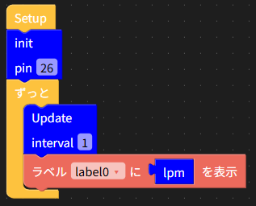

# YFS401 UIFlow Custom Block

M5Stack の [UIFlow](https://uiflow.m5stack.com/) から、YF-S401 パルス出力式水流量センサーを扱うためのカスタムブロック（`YFS401.m5b`）です。

## 何をするブロックか

YF-S401 はホール効果式のパルス出力（PWM/矩形波）を出す水流量センサーです。UIFlow には専用ブロックが無いため、GPIO 割り込みでパルスをカウントし、流量（L/min）に変換する処理をカスタムブロック化しています。

Blockly 上では次の3ブロックとして扱えます。

| ブロック | 種類 | パラメータ | 内容 |
|---|---|---|---|
| `init` | Execute | `pin`（GPIO番号） | センサーの信号線を接続した GPIO を入力に設定し、パルスカウント用の割り込みを登録する（Setup 内で1回だけ呼ぶ） |
| `Update` | Execute | `interval`（秒） | 指定秒数だけ待ち、その間のパルス数から流量（L/min）を計算して内部状態を更新する（ずっとループ内で毎回呼ぶ） |
| `lpm` | Value | なし | 直近の `Update` で計算した流量（L/min）を返す |

## 配線

| YF-S401 | 接続先 |
|---|---|
| 赤（Vsup） | 5V（4.5〜24V対応） |
| 黒（GND） | GND |
| 黄（Signal Out） | 任意の GPIO（例: G26） |

信号線はパルス出力なので、内部プルアップが効かない入力専用ピン（G34/G35/G36/G39など）は避けてください。

## 使い方

1. UIFlow の Custom（Beta）グループから `Open *.m5b file` で `YFS401.m5b` を読み込む
2. Setup 内で `init` ブロックに GPIO 番号（信号線を繋いだピン）を指定して配置（例はPortB G26）
3. ずっと（forever）ループ内で `Update` ブロックを呼ぶ（`interval` は測定間隔、通常は `1` 秒でよい）
4. 流量を使いたい場所（ラベル表示など）に `lpm` ブロックを接続する



## 流量計算式

データシート記載の値に基づいています。

- 1L = 5880 パルス
- F(Hz) = 98 × Q(L/min)

`Update` ブロック内部では、1秒あたりのパルス数を 98 で割ることで L/min を算出しています。`interval` を1秒以外にする場合は、パルス数を秒数で正規化してから計算しています。

> **注意**: 個体差・配管条件により誤差（データシート上は±5%程度）が出ます。正確な値が必要な場合は既知の水量を流してパルス数を実測し、係数を校正してください。（値がカスタムブロック内でハードコードされていますので、校正はUIFlow Block Makerで `YFS401.m5b` を読み込んで行う必要があります）

## 実装上の注意（`global` について）

当初、UIFlow のカスタムブロックのコード欄に `global` で変数を定義しましたが、`identifier redefined as global` エラーが発生しました。どうやら、既知のバグでコード生成時に `global` 以降のテキストが変数リストに置き換わってしまうようです（["Identifier redefined as global" error when using Blockly functions | M5Stack Community](https://community.m5stack.com/topic/2233/identifier-redefined-as-global-error-when-using-blockly-functions)）。そのため本ブロックでは、内部状態（パルスカウント値・計算後の流量）をリスト1つ（ミュータブルオブジェクト）に持たせ、要素を書き換えることで `global` 宣言を使わずに実装しています。

```python
yfs401_state = [0, 0]  # [pulse_count, flow_rate_lpm]

def _yfs401_count_pulse(p):
    yfs401_state[0] += 1  # global 不要（名前の再束縛ではなく要素の書き換え）
```

## 対象デバイス

M5Stack UIFlow が動作するデバイス全般（M5GO / Core / Core2 など）で動作するはずです。動作確認はM5GOで行っています。GPIO の空きピンがあれば基本的にどの機種でも利用可能です。

## ライセンス

MIT
